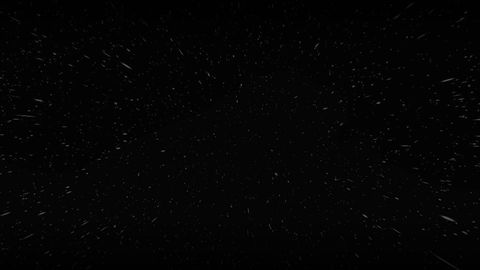

  
  
  ### Fullstack Developer // Design Enthusiast
  
  Passionate about building clean, performant, and user-centric digital experiences.  
  Based in Bangkok, Thailand 🇹🇭
  
  [Portfolio](https://mrtongx0.github.io/) • [LinkedIn](https://www.linkedin.com/in/mrtongx0/) • [Email](mailto:tongsukkha@gmail.com)

---

### 🚀 About Me

  

I am a Fullstack Developer who loves the intersection of **clean code** and **minimalist design**. I specialize in building scalable backend systems with **NestJS** and crafting immersive frontends with **React**. I'm currently focused on developing platforms that support creators and real-time interactive tools.

- 🛠️ Currently building: **Creator Support Platform** & **TikTok Interactive Tools**
- 🎨 Design Philosophy: **Light Minimalism & Clean Typography**
- ⚡ Fun fact: I enjoy creating automated video content using code (Remotion).

---

### 💻 Tech Stack

  
  
  
  

  
  
  
  

---

### 🌟 Featured Projects

| Project | Description | Tech Stack |
| :--- | :--- | :--- |
| **[Creator Support Platform](https://github.com/MrToNGx0/creator-support-platform)** | A system for creators to manage donations and interact with fans. | NestJS, Prisma, Redis, Discord API |
| **[Challenge Timer](https://github.com/MrToNGx0/challenge-timer-backend)** | Real-time interactive timer for TikTok challenges. | NestJS, Socket.io, TikTok Integration |
| **[Personal Portfolio](https://github.com/MrToNGx0/mrtongx0.github.io)** | A high-performance, minimalist portfolio site. | React, Framer Motion, Tailwind |
| **[Star Wars Credits](https://github.com/MrToNGx0/star-wars-credits)** | Procedural video generation for cinematic credits. | Remotion, TypeScript |

---

### 📊 GitHub Stats

  
  

  

---

  Built with ❤️ by Jukkrit Sukkha

